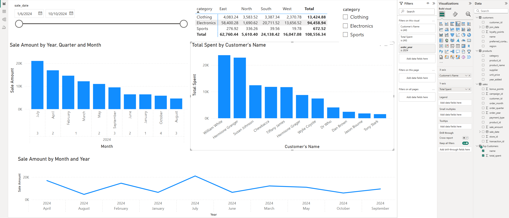

# smart-sales-starter-files

Starter files to initialize the smart sales project.

-----

## Project Setup Guide (1-Mac/Linux)

Run all commands from a terminal in the root project folder. 

### Step 1A - Create a Local Project Virtual Environment

```shell
python3 -m venv .venv
```

### Step 1B - Activate the Virtual Environment

```shell
source .venv/bin/activate
```

### Step 1C - Install Packages

```shell
python3 -m pip install --upgrade -r requirements.txt
```

### Step 1D - Optional: Verify .venv Setup

```shell
python3 -m datafun_venv_checker.venv_checker
```

### Step 1E - Run the initial project script

```shell
python3 scripts/data_prep.py
```

-----

## Project Setup Guide (2-Windows)

Run all commands from a PowerShell terminal in the root project folder.

### Step 2 - Git Pull Before Changes

```shell
git pull origin main
```

### Step 2A - Create a Local Project Virtual Environment

```shell
py -m venv .venv
```

### Step 2B - Activate the Virtual Environment

```shell
.venv\Scripts\activate
```

### Step 2C - Install Packages

```shell
py -m pip install --upgrade -r requirements.txt
```

### Step 2D - Optional: Verify .venv Setup

```shell
py -m datafun_venv_checker.venv_checker
```

### Step 2E - Run the initial project script

```shell
py scripts/data_prep.py
```
## Git Commands Used for Module 2
Below are the Git commands I used to initialize my project, track changes, and push updates to GitHub.

```sh
# Initialize a new Git repository (only needed once)  
git init  

# Add all files to Git tracking  
git add .  

# Commit the changes with a meaningful message  
git commit -m "add starter files"  

# Push changes to GitHub on the main branch  
git push -u origin main  

# After making additional changes on README, use these commands:  
git add .  
git commit -m "Update README with commands"  
git push  
```
-----

## Data Cleaning & Prepare for ETL (P3)

In this module, we focus on cleaning and preparing the data for analysis.

### Step 3a - Create Folders
1. data
   - raw
   - prepared
2. scripts
3. utils

### Step 3b - Download Data Files
Find raw data .csv files in course repo and download to data/raw folder
- customers_data.csv
- products_data.csv
- sales_data.csv

### Step 3c - Create logger.py and data_prep.py

1. Create `logger.py` file under utils folder
2. Find `logger.py` file in course repo and copy/paste contents into local `logger.py`
3. Create `data_prep.py` file under scripts folder
4. Find `data_prep.py` file under `smart-sales-starter-files` repo and copy/paste nto local `data_prep.py`
5. Execute Python script:
```
py scripts\data_prep.py
```
### Step 3d - Run Data Scrubber Tests
Before running the main data preparation script, execute the following test script to ensure the data_scrubber.py is working properly:

```shell
py tests\test_data_scrubber.py
```
### Step 3e - Final Data Preparation
After confirming that the data_scrubber.py is working as expected, run the main data preparation script:

```shell
py scripts/data_prep.py
```
-----

## Data Warehouse (P4)

This module stores cleaned sales, product, and customer data in a SQLite database (smart_sales.db). Data is extracted, transformed, and loaded (ETL) from pre-processed CSV files into three main tables: customer, product, and sale, for direct querying or integration with business intelligence tools.

### Running the ETL Script

To create the database, tables, and insert data from the cleaned CSV files, run the following command:

```shell
py scripts\etl_to_dw.py
```

## Database Schema

### `sale` Table

| Column Name     | Data Type | Description                                |
|-----------------|-----------|--------------------------------------------|
| transaction_id | INTEGER   | Primary key                                |
| sale_date      | DATE      | Sale date                                 |
| customer_id    | INTEGER   | Foreign key referencing `customer` table   |
| product_id     | INTEGER   | Foreign key referencing `product` table    |
| store_id       | INTEGER   | Foreign key referencing `store` table      |
| campaign_id    | INTEGER   | Foreign key referencing `campaign` table   |
| sale_amount    | REAL      | Total amount of sale                       |
| bonus_points   | INTEGER   | Bonus points earned                        |
| payment_type   | TEXT      | Type of payment                            |

---

### `customer` Table

| Column Name         | Data Type | Description                                   |
|--------------------|-----------|-----------------------------------------------|
| customer_id        | INTEGER   | Primary key                                   |
| name               | TEXT      | Customer's name                               |
| region             | TEXT      | Region where customer resides                  |
| join_date          | DATE      | Customer's join date                           |
| loyalty_points     | INTEGER   | Loyalty points customer earned                 |
| preferred_contact  | TEXT      | Preferred contact method for customer          |

---

### `product` Table

| Column Name      | Data Type | Description                                 |
|------------------|-----------|---------------------------------------------|
| product_id      | INTEGER   | Primary key                                 |
| product_name    | TEXT      | Name of the product                          |
| category        | TEXT      | Category of the product                      |
| unit_price      | REAL      | Price per unit of the product                |
| year_added      | INTEGER   | Year the product was added                   |
| supplier        | TEXT      | Name of the supplier                          |

---

## Table Previews

### Customer Table

eenshot.png)

### Product Table


### Sale Table


## Loading Data into the Data Warehouse
1. Prepared data files are loaded into the SQLite database using `etl_to_dw.py`:
   ```sh
   python scripts/etl_to_dw.py

## Power BI (P3)

This module is about learning how to work with large amounts of data using tools like Power BI and Apache Spark. It looks at how cloud platforms and big data processing come together to help us analyze and visualize data faster and more efficiently.

## SQL Queries and Reports

The queries below are used to sort top customers by their total spending: 

```shell
= Odbc.Query("dsn=SmartSalesDSN", "SELECT c.name, SUM(s.sale_amount) AS total_spent
FROM sales s
JOIN customers c ON s.customer_id = c.customer_id
GROUP BY c.name
ORDER BY total_spent DESC")
```

## Design Choices

The dashboard was created with the following goals in mind:

- Key Metrics: I highlighted important metrics such as total sales, top customers, and how sales changed across different dates so that the information is easy to understand.
- User-Driven Exploration: I used filters for regions, categories, and time ranges to let users explore the data in different ways.
- Effective Visuals: I chose to use bar charts and line graphs to clearly show trends and how values change over time.

## Power BI Model View / Spark SQL Schema


## Query Results


## Final Dashboard / Charts



-----

## P6: BI Insights and Storytelling

Three key objectives shaped the direction of this project:
1. Total Sales by Preferred Contact Method
2. Top Performing Products Category by Region
3. Total Sales by Month and Products

This analysis aims to assess sales performance from multiple perspectives, such as contact methods, product categories by region, monthly trends, and individual product performance. These insights are critical for optimizing customer outreach, regional product focus, and inventory management. By identifying which contact methods drive higher sales, understanding top-performing product categories in each region, and tracking monthly and product-level sales, the business can make more informed decisions in marketing strategies and operational efficiency.

### Data Source
The data used in this analysis was sourced from the Smart Store Database (smart_sales.db). The following tables and columns were used:

sales table:
- sale_date: The date of the sale.
- sale_amount: Total dollar amount of the transaction.
- customer_id: Identifier for the customer.
- product_id: Identifier for the product sold.

products table:
- product_id: Unique product identifier.
- category: Classification of the product.

customers table:
- customer_id: Identifier for the customer.
- preferred_contact_method: Customer’s preferred communication channel (call, email, etc.).
- region: Geographic region of the customer.

### Tools
Tools Used:
- Matplotlib & Seaborn: Used to create meaningful visualizations, including bar charts and line graphs.
- Pandas: Essential for data manipulation, aggregation, and performing OLAP-style transformations.
- Python: The primary language used for analysis, data processing, and generating visualizations.
- VSCode: Integrated development environment used for writing Python scripts, querying the SQLite database, and visualizing the results.
- SQLite: Used to manage and extract structured data from the Smart Sales Database.

### Workflow & Logic
Visualizations generated during the analysis include:
1. Sales by Contact Method: Pie chart showing how different methods contribute to overall sales.
2. Category Sales by Region: Log-scaled bar chart showing the performance of product categories by region.
3. Monthly Sales Trend: Line graph showing total sales per month, with individual product performance insights.

### Results


### Suggested Business Action

- Marketing and Outreach: Direct marketing and customer outreach efforts toward the most effective contact methods based on sales performance.
- Product Stocking and Promotion: Tailor product stocking and promotional strategies based on regional performance, with a focus on high-performing categories
- Forecasting and Resource Allocation: Use monthly sales trends for forecasting future sales and adjusting inventory or marketing strategies for high and low seasons.
- Promotional Campaigns: Highlight top-selling products in upcoming campaigns to capitalize on their proven demand.

### Challenges
Several challenges arose during the analysis, including:

- Data Integrity Issues: Ensuring accurate joins across the sales, products, and customers tables was difficult, especially with mismatched keys or missing records. These issues were addressed by carefully cleaning the data and verifying column names.
- Designing Visualizations: Handling many categories and regions in visualizations was challenging. Customization techniques were used to ensure clarity and readability while displaying all the relevant data.

-----

# LeBron James Career Stats Dashboard – Visualizing NBA Greatness Over Time

---

## Section 1. The Business Goal
The goal of this project is to analyze LeBron James’ career statistics from 2003 to present. By identifying key trends, peak performance seasons, and overall career progression, this dashboard helps both fans and sports analysts gain deeper insights into LeBron’s impact and evolution over time.

---

## Section 2. Data Source
The data was sourced from:
- **Statmuse.com**: Web-based platform offering NBA career statistics.
- The dataset includes key metrics such as points, assists, rebounds, steals, games played, field goals, free throws, and 3-point shots from 2003 to present.

---

## Section 3. Tools Used
- **Power BI**: Used for data modeling, visualization, and dashboard design.
- **Power Query Editor**: Used for data cleaning, transforming the season format, and checking data quality.
- **Data Analysis Expressions (DAX)**: Used to calculate totals, averages, and rankings.

---

## Section 4. Workflow & Logic
- Loaded career data into Power BI using the web connector.
- Cleaned the data in Power Query Editor by:
  - Checking column quality (`View > Column Quality`) to identify issues.
  - Extracting the starting year from the `Season` column for better visual clarity.
- Created calculated columns and measures using DAX for:
  - Totals and averages of key stats.
  - Ranking and sorting for top 5 scoring seasons and best 3-point years.
- Built visualizations to explore trends and highlight career peaks.

---

## Section 5. Results

### Visualizations

- **Cards**: Summed and averaged stats for Points, Assists, Rebounds, and Steals.
- **Line Chart**: Points per season to visualize scoring progression.
- **Stacked Bar Chart**: Top 5 scoring seasons for peak performance analysis.
- **Stacked Column Chart**: 3-point shots made by season.
- **Tooltips**: Display Games Played, Field Goals, and Free Throws for deeper context on each visual.


### Key Insights

- LeBron’s scoring has shown remarkable consistency, with clear peak years.
- His 3-point shooting improved significantly in later seasons.
- Playmaking and all-around contributions have remained strong throughout his career.

---

## Section 6. Suggested Business Action
- **Performance Analysis for Commentary or Training**: Coaches, trainers, or broadcasters can use this data to discuss LeBron's evolution and optimize training for similar player types.
- **Fan Engagement**: Media teams can build visual stories around his peak seasons, fueling conversation and engagement on sports platforms.
- **Scouting Insights**: Use trends to help scout or compare rising players who mirror LeBron’s early performance trajectory.

---

## Section 7. Challenges
- **Data Consistency Across Seasons**: Ensuring data accuracy for every NBA season was a challenge due to variations in stat formatting and availability.
- **Metric Limitations**: Some seasons lacked advanced metrics like PER or efficiency ratings, which could offer even deeper analysis.
- **Time Range**: The large number of seasons made it important to find a balance between detailed breakdowns and dashboard clarity.

---

## Section 8. Ethical Considerations
- **Data Accuracy and Source Credibility**: Data was taken from a trusted NBA stats site (Statmuse), but should be verified against official NBA databases for critical decisions.
- **Contextual Awareness**: Stats alone don’t capture context like injuries or team changes, so it’s important to avoid overgeneralization.
- **Fan Bias and Misinterpretation**: Clear labeling and honest presentation were used to avoid feeding narrative bias or misleading conclusions.

-----

## Initial Package List

- pip
- loguru
- ipykernel
- jupyterlab
- numpy
- pandas
- matplotlib
- seaborn
- plotly
- pyspark==4.0.0.dev1
- pyspark[sql]
- git+https://github.com/denisecase/datafun-venv-checker.git#egg=datafun_venv_checker

